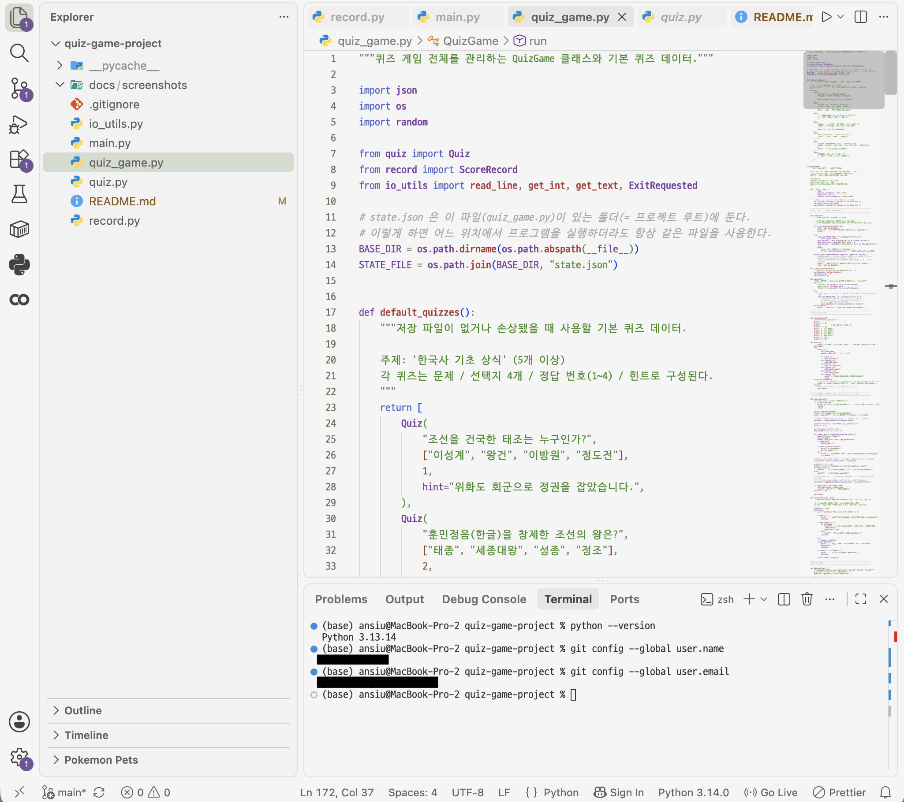
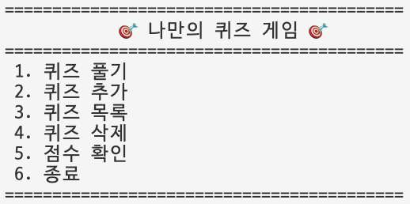
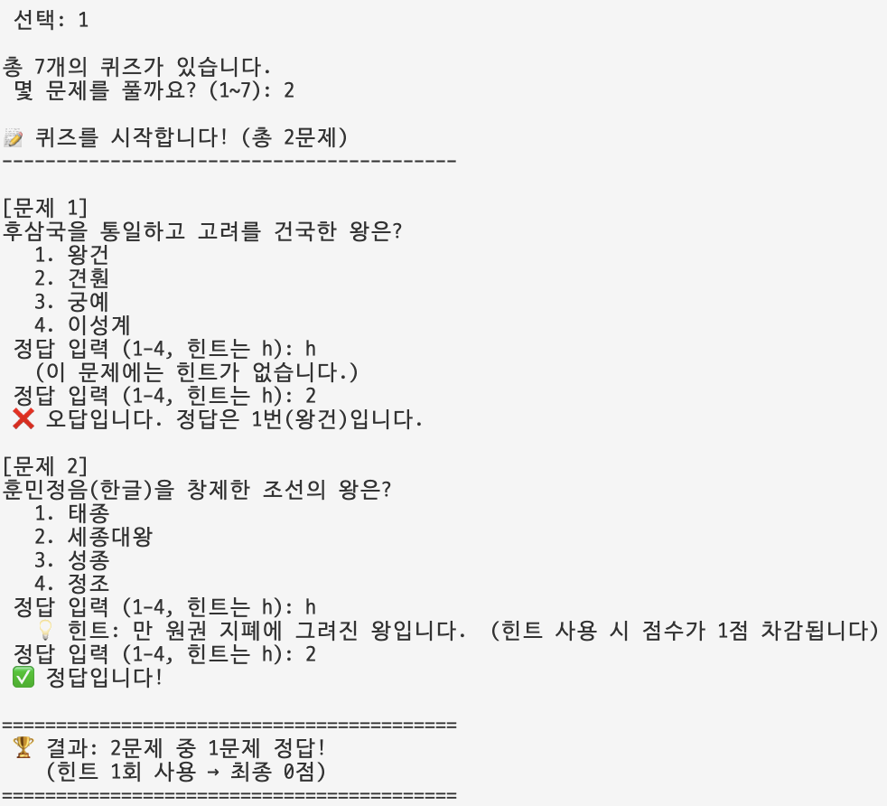
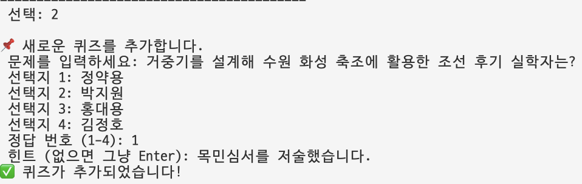
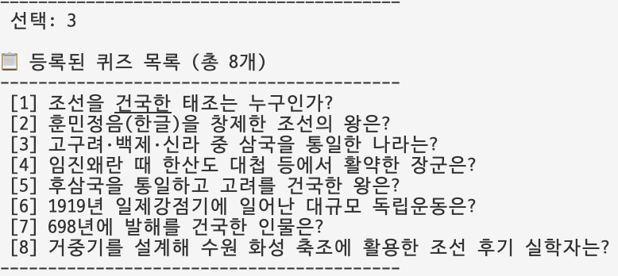
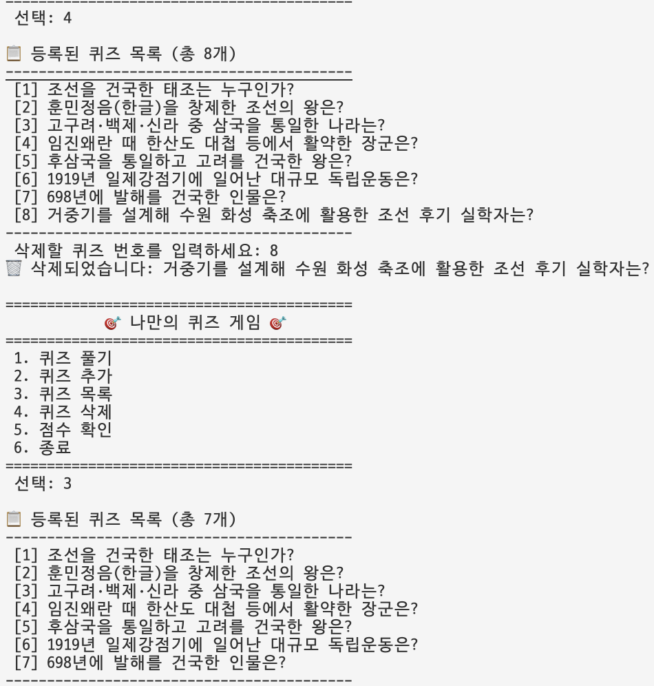
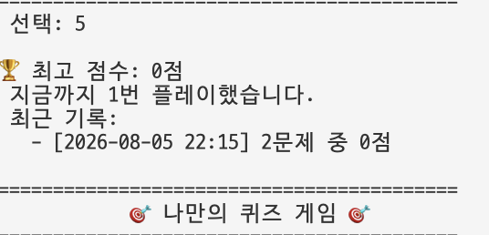
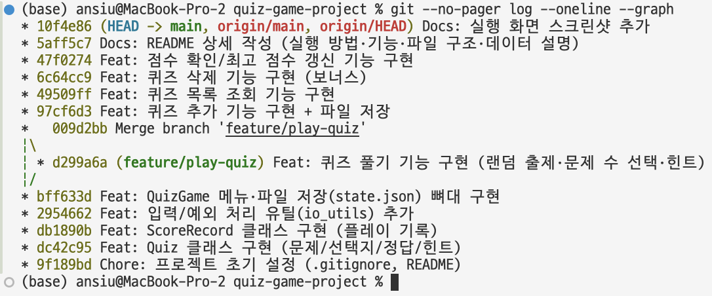

# 🎯 나만의 퀴즈 게임 (Python Console Quiz Game)

터미널에서 동작하는 Python 콘솔 퀴즈 게임입니다.
Python 기본 문법 · 클래스(객체 지향) · JSON 파일 저장(데이터 영속성) · Git 워크플로우를 직접 구현하며 학습한 결과물입니다.

---

## 1. 프로젝트 개요

메뉴에서 번호를 선택해 **퀴즈 풀기 / 추가 / 목록 / 삭제 / 점수 확인**을 할 수 있는 프로그램입니다.
추가한 퀴즈와 최고 점수는 `state.json` 파일에 저장되어, 프로그램을 종료했다가 다시 실행해도 그대로 유지됩니다.

- 언어: Python 3.10+
- 외부 라이브러리 없이 표준 라이브러리(`json`, `os`, `random`, `datetime`)만 사용
- 역할별로 클래스(`Quiz`, `ScoreRecord`, `QuizGame`)와 함수를 분리한 구조

## 2. 퀴즈 주제와 선정 이유

**주제: 한국사 기초 상식**

삼국·고려·조선·근현대사에 걸쳐 누구나 한 번쯤 배웠지만 헷갈리기 쉬운 핵심 사건과 인물을 문제로 만들었습니다.
정답과 함께 간단한 힌트를 붙여, 게임을 즐기면서 자연스럽게 우리 역사 상식을 복습할 수 있도록 이 주제를 선택했습니다.
새로운 역사 지식을 배울 때마다 '퀴즈 추가' 기능으로 나만의 문제를 계속 늘려갈 수 있는 점도 장점입니다.

## 3. 실행 방법

```bash
# 저장소를 클론한 뒤
git clone https://github.com/SIUUU1/quiz-game-project
cd quiz-game

# 실행 (Python 3.10 이상)
python main.py
```

> 별도의 설치 과정이 필요 없습니다. 표준 라이브러리만 사용합니다.

## 4. 기능 목록

| 메뉴 | 기능 | 설명 |
|------|------|------|
| 1 | 퀴즈 풀기 | 문제 수를 선택해 랜덤 출제, 정답/오답 채점, 결과·점수 표시 |
| 2 | 퀴즈 추가 | 문제·선택지 4개·정답 번호·힌트를 입력받아 등록하고 저장 |
| 3 | 퀴즈 목록 | 등록된 모든 퀴즈의 문제 목록 표시 |
| 4 | 퀴즈 삭제 | 번호를 선택해 퀴즈 삭제(보너스) |
| 5 | 점수 확인 | 최고 점수와 최근 플레이 기록 표시 |
| 6 | 종료 | 데이터를 저장하고 프로그램 종료 |

**입력/예외 처리**
- 입력 앞뒤 공백 자동 제거
- 숫자 아님(`abc`) / 빈 입력 / 허용 범위 밖(`0`, `9` 등) → 안내 후 재입력
- `Ctrl+C`(KeyboardInterrupt), 입력 종료(EOFError) → 안내 후 안전하게 저장·종료
- 데이터 파일이 없거나 손상돼도 실행 가능(기본 퀴즈로 복구)

**보너스 기능**
- 랜덤 출제 · 풀 문제 수 선택 · 힌트(사용 시 1점 차감) · 퀴즈 삭제 · 플레이 기록(히스토리)

## 5. 실행 화면

**개발 환경 설정** (VSCode · Python 버전 · Git 설정)



**메뉴 화면**



**퀴즈 풀기**



**퀴즈 추가**



**퀴즈 목록**



**퀴즈 삭제**



**점수 확인**



**종료**


**Git 커밋 그래프** (`git log --oneline --graph`)



## 6. 파일 구조

```
quiz-game/
├── main.py          # 프로그램 진입점 (python main.py 로 실행)
├── quiz.py          # Quiz 클래스 (문제 한 개를 표현)
├── record.py        # ScoreRecord 클래스 (게임 한 판의 기록: 날짜/문제 수/점수)
├── quiz_game.py     # QuizGame 클래스 + 기본 퀴즈 데이터 (게임 전체 관리)
├── io_utils.py      # 입력/예외 처리 도우미 함수
├── state.json       # 퀴즈 데이터와 최고 점수 저장 파일 (실행 시 자동 생성)
├── .gitignore
├── README.md
└── docs/
    └── screenshots/ # 제출용 실행 화면 스크린샷
```

## 7. 데이터 파일 설명 (`state.json`)

- **경로**: 프로젝트 루트의 `state.json` (프로그램 실행 시 자동 생성/갱신)
- **역할**: 퀴즈 목록 · 최고 점수 · 플레이 기록을 저장해 재실행 시에도 데이터를 유지
- **인코딩**: UTF-8 (`ensure_ascii=False` 로 한글 그대로 저장)

**스키마(구조) 예시**

```json
{
  "quizzes": [
    {
      "question": "조선을 건국한 태조는 누구인가?",
      "choices": ["이성계", "왕건", "이방원", "정도전"],
      "answer": 1,
      "hint": "위화도 회군으로 정권을 잡았습니다."
    }
  ],
  "best_score": 3,
  "history": [
    { "date": "2026-08-04 14:30", "count": 5, "score": 4 }
  ]
}
```

| 필드 | 타입 | 설명 |
|------|------|------|
| `quizzes` | list | 퀴즈 목록. 각 항목은 `question`, `choices`(4개), `answer`(1~4), `hint` |
| `best_score` | int | 최고 점수(최고 정답 수 기준) |
| `history` | list | 플레이 기록(`date`: 날짜/시간, `count`: 푼 문제 수, `score`: 최종 점수) |

> 파일이 없으면 코드에 내장된 기본 퀴즈로 시작하고, 파일이 손상된 경우 안내 후 기본 데이터로 복구합니다.